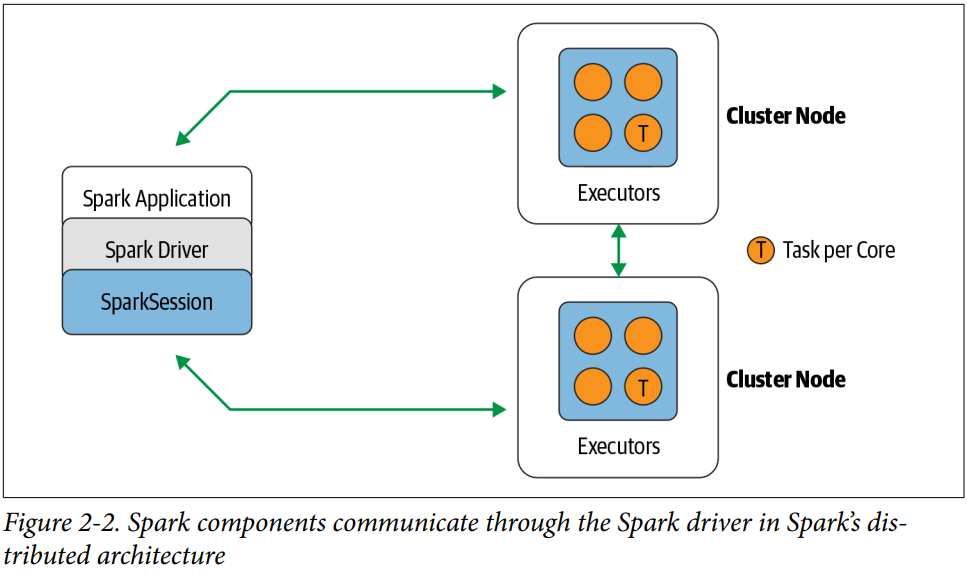
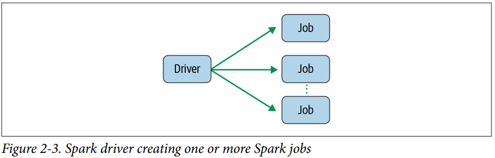
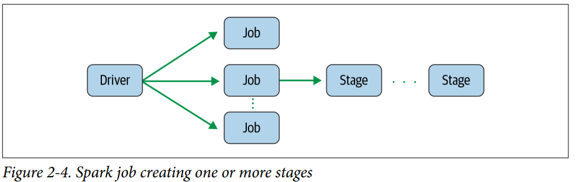
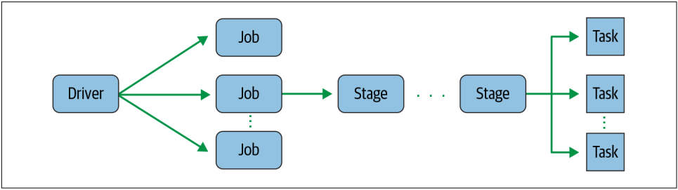
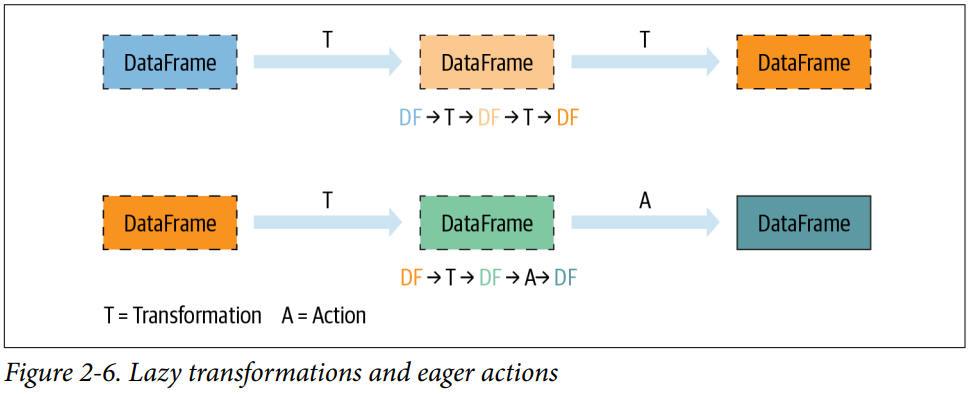
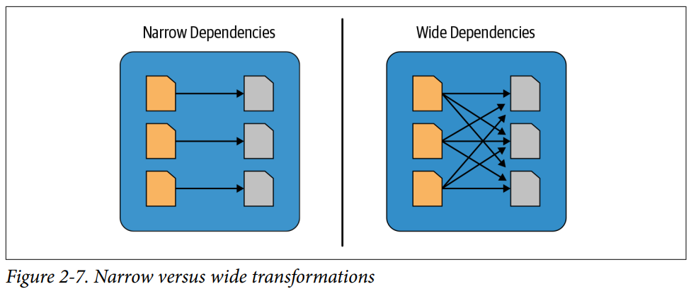

Download apache spark and getting started

---

# 1. Understanding Spark Application Concepts

- Application: a user program built on Spark using its APIs. It consists of a driver program and executors on the cluster
- SparkSession: an object that provides a point of entry to interact with underlying Spark functionality and allows programming Spark with its APIs. In an interactive Spark shell, the Spark driver instantiates a SparkSession for you, while a Spark application, you create a SparkSession object yourself.
- Job: A parallel computation consisting of multiple tasks that gets spawned in response to a Spark action (e.g., save(), collect())
- Stage: each job gets divided into smaller sets of tasks called stages that depend on each other
- Task: a single unit of work or execution that will be sent to a Spark executor.

## 1.1. Spark Application and SparkSessions

- At the core of every Spark application is the Spark driver program, which creates a SparkSession object.
- Once you have a SparkSession, you can program Spark using the APIs to perform Spark operations.
  

## 1.2. Spark Jobs

- The driver converts your Spark applicaton into one or more Spark Jobs then transforms each job into a DAG.
- In essence, this is Spark's execution plan, where each node within a DAG could be a single or multiple Spark stages.
  

## 1.3. Spark Stages

- As part of the DAG nodes, stages are created based on what operations can be performed serially or in parallel.
- Not all Spark operations can happen in a single stage, so they may be divided into multiple stages. Often
  

# 1.4. Spark Tasks

- Each stage is comprised of Spark tasks (a unit of execution), which are then federated across each Spark executor; each task maps to a single core and works on a single partition of data.
- As such, an executor with 16 cores can have 16 or more tasks working on 16 or more partitions in parallel, making the execution of Spark's tasks exceedingly parallel!
  

# 2. Transformations, Actions, and Lazy Evaluation

There are 2 types of operations on Spark: **transformations** and **actions**

**Transformations**:

- Transform a Spark DataFrame into a new DataFrame without altering the original data, giving it the property of immutability.
- All transformations are evaluated lazily.
- Their results are not computed immediately, but they are recorded or remember as a **lineage**

**Actions**:

- An action triggers the lazy evaluation of all the recorded transformations.

While lazy evaluation allows Spark to optimized your queries by peeking into your chained transformations, lineage and data immutability provide fault tolerance.

## 2.1. Narrow and Wide Transformations
Transformations can be classified as having either **narrow dependencies** or **wide dependencies**.
- Any transformation where a single output partition can be computed from a single input partition is a **narrow** transformation (e.g., filter(), contains())
- grouBy() or orderBy() instruct Spark to perform **wide** transformations, where data from other partitions is read in, combined, and written to disk. These transformations will force a shuffle of data from each of the executor's partitions across the cluster so they requires output from other partitions to compute the final aggregation.

# 3. The Spark UI
