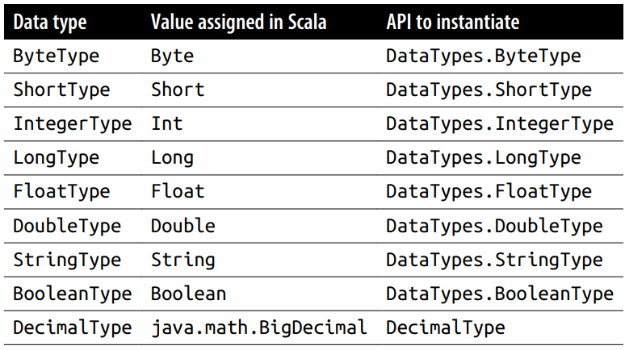
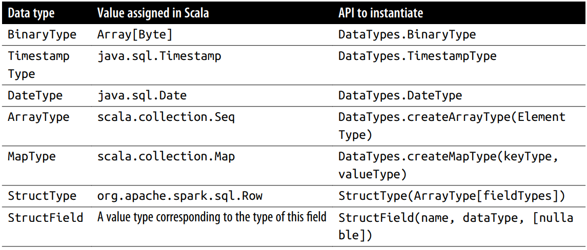
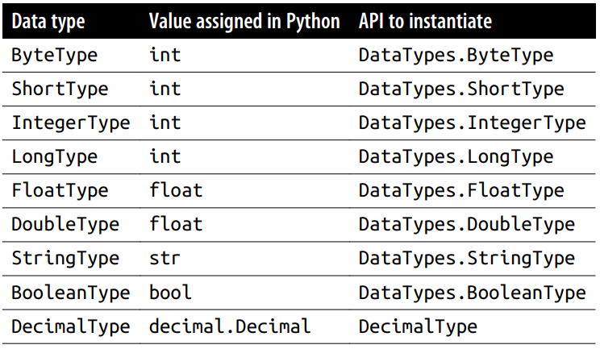
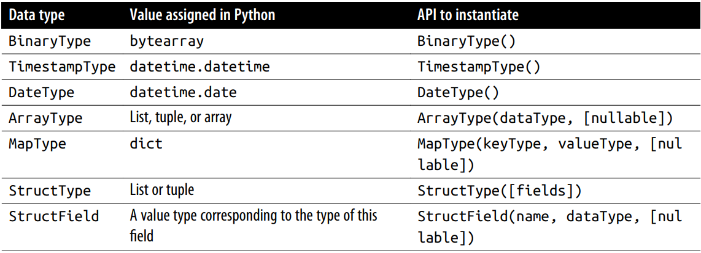
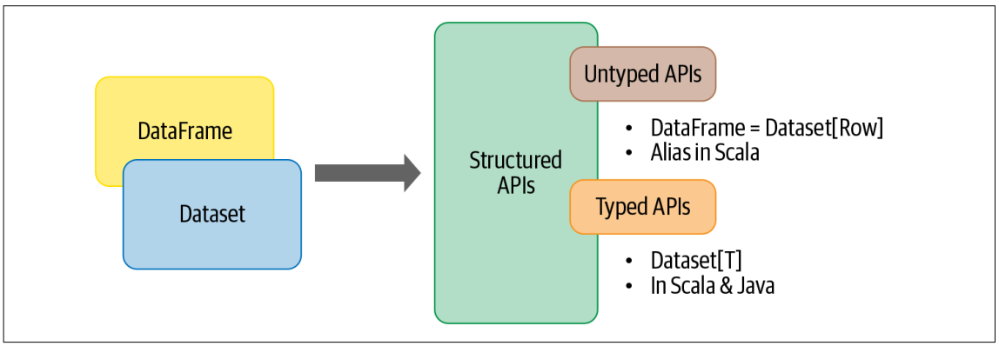
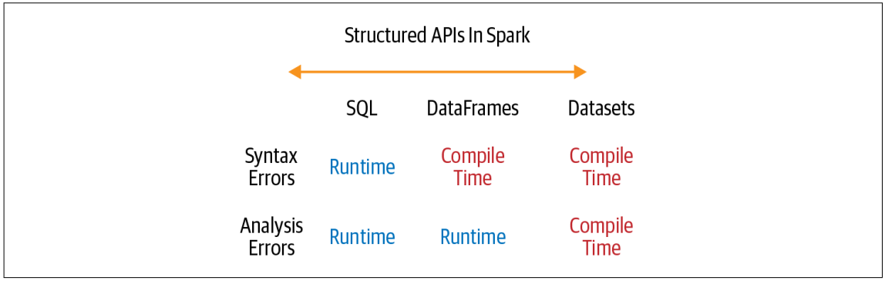
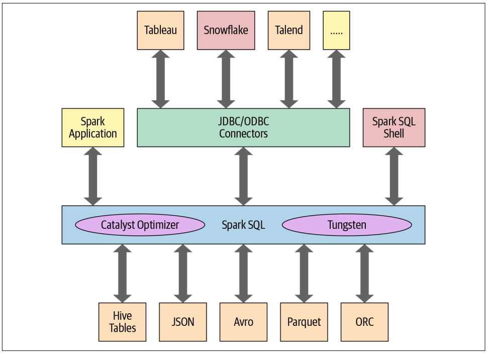
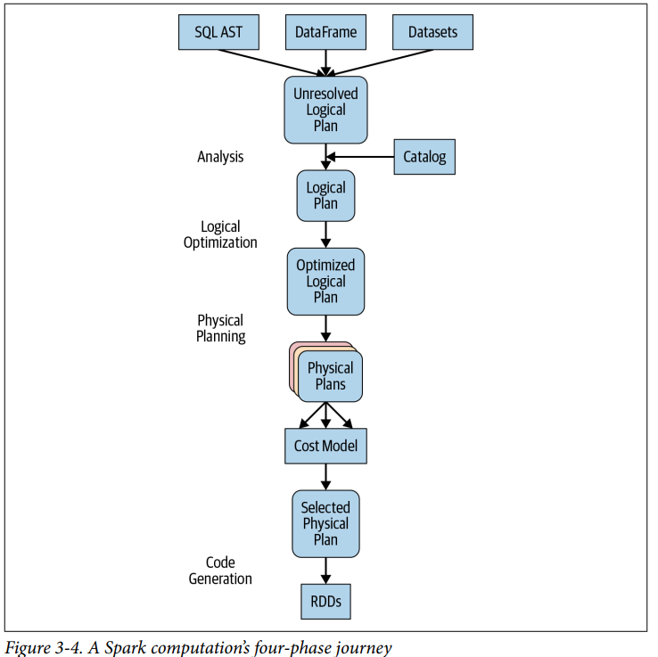

Chapter 3: Apache Spark's Structured APIs

---

# Spark: What's Underneath an RDD

RDD is the most basic abstraction in Spark. There are three vitial characteristics associated with an RDD:

1. **Dependencies** - A list of dependencies that instructs Spark how an RDD is constructed with its inputs is required. When necessary to reproduce results, Spark can recreate an RDD from these dependencies and replicate operations on it. This characteristic gives RDDs resiliency.
2. **Partitions (with some locality information)** - Partitions provide Spark the ability to split the work to parallelize computation on partitions across executors. In some cases, for example, reading from HDFS, Spark will use locality information to send work to executors close to the data.
3. **Compute function: Partition => Iterator[T]** - RDD has a compute function that produces an Iterator[T] for the data that will be stored in the RDD.

There are a couple of problems with this original model:

- The compute function (or computation) is opaque to Spark => Spark does not know what you are doing in the compute function
- Because it's unable to inspect the computation or expression in the function, Spark has no way to optimize the expression
- Spark has no knowledge of the specific data type in T

=> All Spark can do is serialize the opaque object as a series of bytes, without using any data compression techniques. This hampers spark's ability to rearrange your computation into an efficient query plan.

# The DataFrame API

Inspired by Pandas DF in structure, format, and a few specific operations, Spark DF are like distributed in-mem tables with named columns and schemas, where each column has a specific data type: integer, string, array, map, real, date, timestamp, etc.

## Spark's Basic Data Types

Scala data types

Python basic data types

## Schemas and Creating DataFrames

A **schema** in SPark defines the column names and associated data types for a DataFrame. Defining a schema up front as opposed to taking a schema-on-read approach offers three benefits:

- Relieving Spark from the onus of inferring data types
- Preventing Spark form creating a separate job just to read a large portion of your file to ascertain the schema, which for a large data file can be expensive and time-consuming.
- You can detect errors early if data doesn't match the schema.

## Common DataFrame Operation

- DFReader, DFWritter: Spark support multiple data sources
- Transformations and actions
- Projections and filters
- Renaming, adding, and dropping columns
- Aggregations
- Others: min(), max(), sum(), avg()

# The Dataset API

- Datasets take on 2 characteristics: typed and untyped APIs
- A Dataset is a collection of strongly typed JVM objects in Scala or a class in Java.

## Typed Objects, Untyped Objects, and Generic Rows

- Datasets make sense only in Java and Scala, whereas in Python and R only DataFrames make sense. Because Python and R are not compile-time type-safe; types are dynamically inferred or assigned during execution, not during compile time. This is opposite with Java and Scala.

## Creating Datasets

- When creating Dataset, you have to know the schema.

# DataFrames vs Datasets

# Spark SQL and the Underlying Engine

## The Catalyst Optimizer

- The Catalyst optimizer takes a computational query and converts it into an execution plan. It goes through 4 transformational phases: analysis, logical optimization, physical planning, code generation

**Phase 1: Analysis**
The spark SQL engine begins by generating an [abstract syntax tree (AST)](https://en.wikipedia.org/wiki/Abstract_syntax_tree) for the SQl of DF query. In this initial phase, any cols or table names will be resolved by consulting an internal Catalog, a programmatic interface to Spark SQL that holds a list of names of columns, data types, functions, tables, databases, etc. Once they're all been successfully resolved, the query proceeds to the next phase.

**Phase 2: Logical Optimization**
This phase comprises 2 internal stages. Applying a standard rule based optimization approach, the Catalyst optimizer will first construct a set of multiple plans and then, using its [cost-based optimizer (CBO)](https://www.databricks.com/blog/2017/08/31/cost-based-optimizer-in-apache-spark-2-2.html), assign costs to each plan. These plan are laid out as operator trees; they may include, for example, the process of constant folding, predicate pushdown, projection pruning, Boolean expression simplification, etc. This logical plan is the input into the physical plan.

**Phase 3: Physical planning**
In this phase, Spark SQL generated an optimal physical plan for the selected logical plan, using physical operators that match those available in the spark execution engine.

**Phase 4: Code generation**
The final phase of query optimization involves generating efficient Java bytecode to run on each machine. Because Spark SQL can operate on data sets loaded in memory, Spark can use sota compiler technology for code generation to speed up execution. In other words, it [acts as a compiler](https://www.databricks.com/blog/2016/05/23/apache-spark-as-a-compiler-joining-a-billion-rows-per-second-on-a-laptop.html). Project Tungsten, which facilitates whole-stage code generation, plays a role here. 