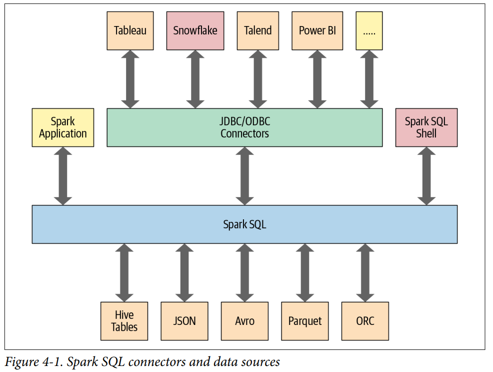

Chapter 4: Spark SQL and DataFrames: Introduction to Built-in Data Sources

In this chapter:

- Provides the engine upon which the high-level Structured APIs we explored in Chapter 3 are built.
- Can read and write data in a variety of structured formats (e.g, JSON, Hive tables, Parquet, Avro, ORC, CSV)
- Lets you query data using JDBC/ODBC connectors from external business intelligence (BI) data sources such as Tableau, Power BI, Talend, or from RDMBSs such as MySQL and PostgresSQL
- Provides a programmatic interface to interact with structured data stored as tables or views in a database from a Spark application
- Offers an interactive shell to issue SQL queries on your structured data
- Support ANSI SQL:2003-compliant commands and HiveQL

---

# Using Spark SQL in spark Applications

# SQL Tables and Views

Instead of having a separate metastore for Spark tables, Spark by default uses the Apache Hive metastore, lovated at /user/hive/warehouse, to persist all the metadata about your tables. However, you may change the default location by settings the Spark config variable spark.sql.warehouse.dir to another location, which can be set to a local or external distributed storage.

## Managed Versus UnmanagedTables

Spark allows you to create 2 types of tables: managed and unmanaged.

**1. Managed table:**
- Spark manages both the matadata and the data in the file store
- SQL commands such as DROP deletes both the metadata and the data.

**2. Unmanaged table:**
- Spark only manages the metadata, while you managae the data yourself in an external data source.
- SQL commands such as DROP deletes only the metadata

## Creating Views
- Disappear after Spark application terminates
- The difference between a view and a table is that views don't actually hold the data; tables persist after your Spark application terminates, but views disappear.
- Keep in mind that when accessing a global temporary view, you must use the prefix global_temp.<view_name>, because Spark creates global temporary views in a global temprary database called global_temp.

## Temporary views versus global temporary views
**1. Temporary views**
- Tied to a single SparkSession within a Spark application.

**2. Global temporary view**
- Visible across multiple SparkSessions within a Spark application

## Viewing the Metadata
- Spark manages the metadata associated with each managed or unmanaged table. This is captured in the Catalog, a high-level abstraction in Spark SQL for storing metadata.

# Data Sources for DataFrames and SQL tables
- DataFrameReader
- DataFrameWriter
- Parquet
- JSON
- CSV
- Avro
- ORC
- Images
- Binary Files